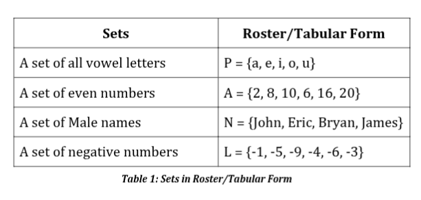
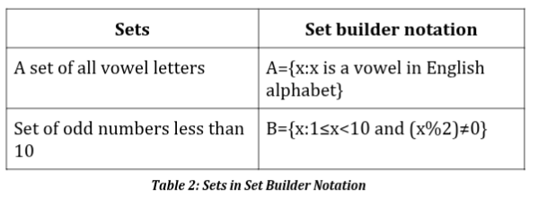

## What is Discrete Mathematics

> - A branch of mathematics that deals with `discrete objects`.

> - `Discrete Objects` are objects which are consists of <br />
    unconnected or distinct elements.

```plaintext
Examples:
    - Integers
    - Rational Numbers
    - Cars
    - People
    - etc.
```

<br />
<br />


## Topics in Discrete Mathematics

<br />

`1. Set Theory`

- A `set` is a collection of elements.

- `Set Theory` deals with well-defined collection of elements or objects.

- It is the basis of other fields of studies such as relations, computing, <br />
  theory, and finite state machines.

- Can be represented by using `roster` or `tabular form`.

| Example: Roster or Tabular Form |
| ------------------------------- |
|  |

<br />

- Can also be represented by using a `Set Builder Notation`.

- This method uses basic algebraic notation to describe properties of the <br />
  elements in a set.

| Example: Set-Builder Notation |
| ----------------------------- |
|  |
